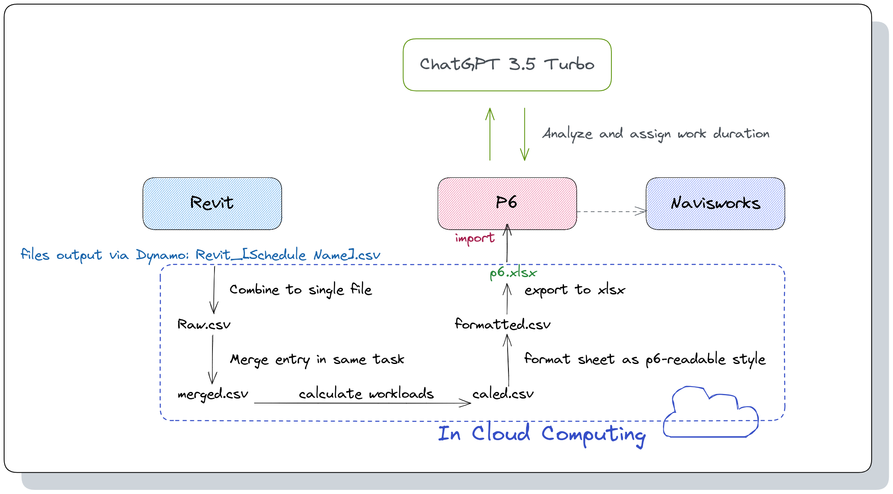

# BD-Toolkit

[](https://conventionalcommits.org)

A Standard data processing script collection as a part of bachelor design.

## Features

This collection aimed to enhance connection between Oracle Primavera, Autodesk Revit and Autodesk Navisworks.

* BD-Toolkit could handle exported P6 xlsx file and Revit csv file data.
* The output files could be imported to the next program in standard workflow by just on step.
* Toolkit has built-in functions to audit, calculation, formatting data.
* ChatGPT+ support for generating report from datas.

FileFlow in script:



## Modules

## Usage

## Road Map

## LICENSE

```
Copyright (c) 2023 Yakkhini
BD-Toolkit is licensed under Mulan PSL v2.
You can use this software according to the terms and conditions of the Mulan PSL v2.
You may obtain a copy of Mulan PSL v2 at:
         http://license.coscl.org.cn/MulanPSL2
THIS SOFTWARE IS PROVIDED ON AN "AS IS" BASIS, WITHOUT WARRANTIES OF ANY KIND,
EITHER EXPRESS OR IMPLIED, INCLUDING BUT NOT LIMITED TO NON-INFRINGEMENT,
MERCHANTABILITY OR FIT FOR A PARTICULAR PURPOSE.
See the Mulan PSL v2 for more details.
```